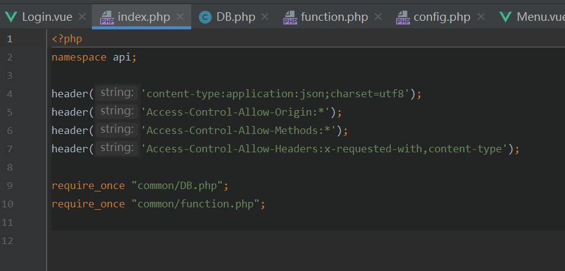
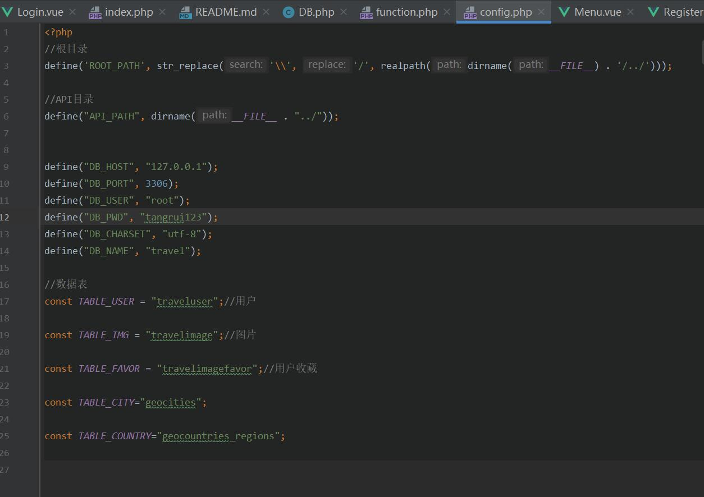
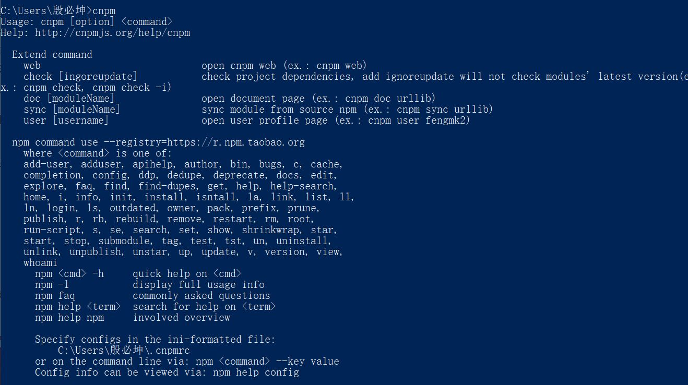
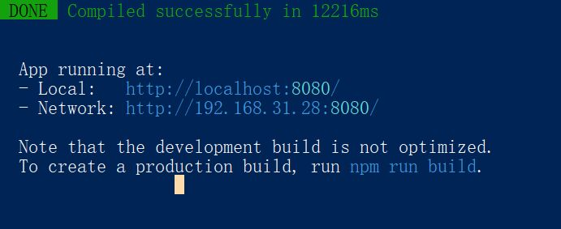
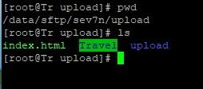
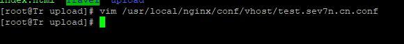
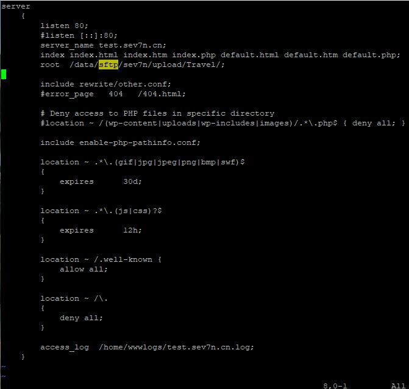
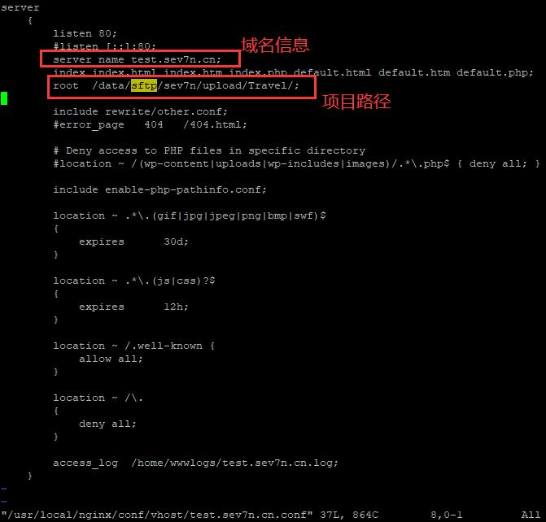
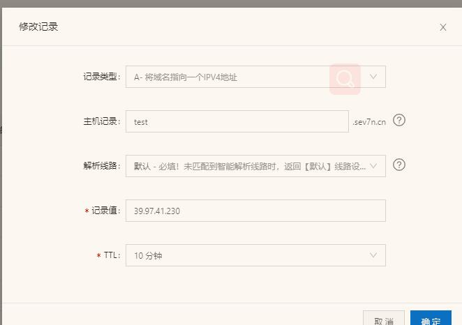

# PJ2设计文档

###殷必坤   17307130218

##项目完成情况

基础功能基本全部实现，在个人测试过程中没有逻辑上的bug，看到助教说页码部分可以随意发挥只要符合逻辑就好，
所以就没有做五页的显示了，感觉使用框架还比较符合逻辑一点，还有单城市的模糊筛选几十万条数据感觉不能放在下拉框内，
因此这个功能并没有实现

由于自己的phpstorm在配置数据库时环境上面可能出了一些奇奇怪怪的bug导致不能用XAMPP和PHP study实现数据库的使用，
所以在部署到服务器的时候，将sql文件放入云端，在index.php里面引入DB用来实现调用和修改数据库的相关操作,
因为数据库是在云端的，因此不使用XAMPP等也可以直接调用数据库

##Bonus完成情况

1.完成了使用vue前端框架对之前pj1已经实现的页面进行了修改和美化，主要代码在front-end\travel\src\views中实现，dist文件夹为vue打包后的文件

2.完成了在服务器部署的操作

使用服务器部署首先要实现node.js和NPM的安装，这个工具可以解决很多部署方面的问题，其中node.js只需要下载安装包就可以，NPM安装如下

localhost:8080或者192.168.31.28:8080都能访问到网站

接下来把项目放到服务器里的Travel目录之下，修改nginx配置文件，主要是修改域名信息和项目路径，截图如下

最后在阿里云上设置二级域名解析就大功告成了

以下是完成后的地址：

http://test.sev7n.cn/dist

##课程建议和评价

希望能早一点讲完pj需要的知识点，不然就一个星期多一点的时间完成这个pj2确实有点太仓促了

老师讲课很详细，助教天团超nice的！

